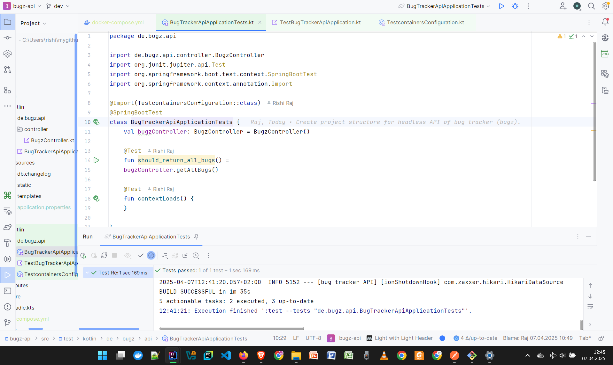

# Bug Tracker (Kotlin implementation)
An intuitive bug tracker for QA (Quality Analyst) engineers and Project Managers, built with:
- Kotlin 1.9.25 (at level Java 21)
- Spring Boot 3.4.1
- JUnit 5 (Jupiter)
- Testcontainers, MockMvc
- MongoDB 7: Database engine (Data store)
- Rest-Assured
- Docker
- lombok

## Functionalities
- Create a new bug
- List a bug, by code (business-specific identifier)
- List all bugs
- Delete a bug, by code
- Delete all bugs
- (X) Update a bug [Not in plan]

## Developer Notes
- [X] Development has been done.
- [_] To implement and use Docker secrets for enhanced security.
- [TDD] Fail, Implement, Pass tests, Refactor. Check up regularly.

## Testing
### Test Automation Configuration
The setup with Docker containerized database is working great!

### Manual Testing
Will be updated later.

#### Create a bug

- The above screenshot is demonstrative, will be updated.

#### List bugs

- The above screenshot is demonstrative, will be updated.

#### Automated Testing
- Test classes is written and used for test automation.

- The above screenshot is demonstrative, will be updated.

- For POST request to create a bug, for example, the following JSON-formatted data can be used to formulate request body (available in repository in `docs` directory):
<pre>{
  "code":"INSTALMENTPAY-001",
  "summary": "first bug in payment in instalments",
  "description":"bug desc",
  "priority":"LOW",
  "project":{
    "name":"INSTALMENTPAY"
  },
  "reporter": {
    "loginName": "rraj",
    "role":"REPORTER"
  },
"assignee": {
    "loginName": "mbibo",
    "role":"DEVELOPER"
  },
  "type":"SOFTWARE_BUG",
"status":"OPEN"
}</pre>

- The respective response is similar to the one shown below (available in repository in `docs` directory):
<pre>{
  "code": "INSTALMENTPAY-001",
  "summary": "first bug in payment in instalments",
  "description": "bug desc",
  "priority": "LOW",
  "projectDTO": {
      "name": "DIRECTDEBITPAY",
      "description": "Pay by Direct Debit"
  },
  "reporterDTO": {
      "loginName": "rraj",
      "role": "REPORTER"
  },
  "assigneeDTO": {
      "loginName": "mbibo",
      "role": "DEVELOPER"
  },
  "dateCreated": "2024-06-16T22:41:40.08377",
  "dateResolved": null,
  "dateClosed": null,
  "type": "SOFTWARE_BUG",
  "status": "OPEN",
  "commentDTOs": null,
  "workHistory": null,
  "attachments": null
}</pre>

## Contact Pointers
- **LinkedIn:** <https://www.linkedin.com/in/rishirajopenminds>
- **HackerRank:** <https://www.hackerrank.com/profile/rishiraj49de>
- **X:** <https://twitter.com/RishiRajDevOps>
- **Start Page:** <https://bio.link/rishiraj49de>
- **GitHub:** <https://github.com/rishiraj88>

## Credits and Gratitude
I thank all who have mentored, taught and guided me. Also, I appreciate who have supported my work with pair programming and more.
